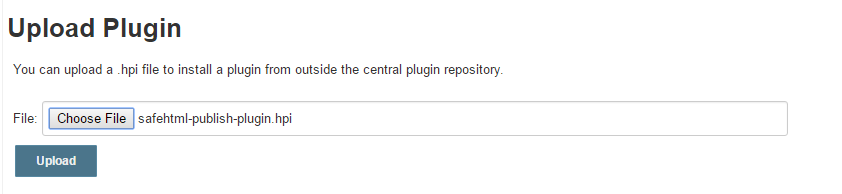
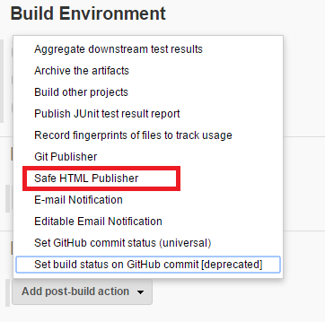
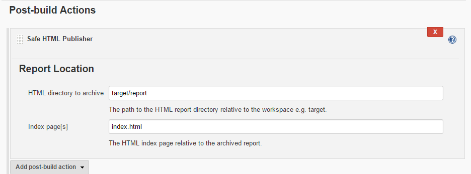
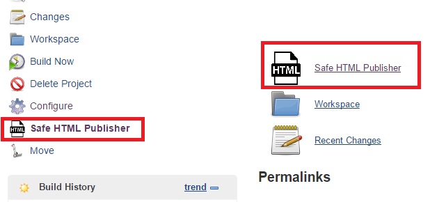

# safehtml-publish-plugin
jenkins benchmark report plugin embody insight benchmark test html report

# How to build
```
mvn clean package
```
It will generate "insight-benchmark-report-plugin.hpi" in "\benchmark-report-plugin\target"

# How to install
+ Manage Jenkins -> plugin Manager -> upload the "insight-benchmark-report-plugin.hpi" 




+ In your jenkins job, Add Post-build action 




+ Setup report setting




+ The new report button will show up in your jenkins jobs




# Reference:
https://github.com/jenkinsci/cucumber-reports-plugin
